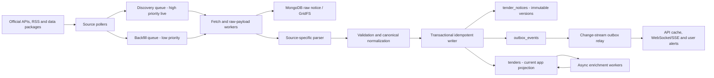

# MongoDB Tender Seeding and Near-Real-Time Ingestion Architecture

## 1. Purpose

This document is the implementation plan for collecting public tender notices from free official sources, seeding historical data, continuously discovering new publications, normalizing them, and serving them from MongoDB.

It replaces the current Supabase/PostgreSQL-oriented persistence design. MongoDB is the only database in the target architecture. A message queue may still be used for durable work delivery, but it must not become a second tender database.

The desired user outcome is:

- newly published tenders normally appear in the application within 5 minutes of becoming available at the official source;
- retries, restarts, and repeated source deliveries do not create duplicate tenders;
- historical seeding does not delay current tenders;
- planning notices, open competitions, awards, modifications, and direct-award notices are represented correctly;
- every record retains its official source, licence, identifiers, raw payload, and processing history;
- national notices and their TED copies can be linked without deleting official source records.

Verification date for source capabilities: **2026-08-05**.

## 2. Architecture decisions

1. **Do not use one daily cron as the primary ingestion mechanism.** Run long-lived pollers through a durable recurring-job scheduler.
2. **Use near-real-time polling where no official webhook exists.** A polling interval is not the same as waiting one day.
3. **Use at-least-once delivery plus idempotent MongoDB upserts.** Do not attempt distributed exactly-once execution.
4. **Keep every official notice version immutable.** Build the current application view separately.
5. **Seed history and ingest live data concurrently.** Live jobs always have higher priority.
6. **Use only official APIs, feeds, or open-data downloads.** Do not scrape search-result pages or commercial tender aggregators.
7. **Treat TED and national portals as overlapping sources.** Preserve both records and link them using strong official identifiers.
8. **Keep geocoding, translation, AI summaries, and embeddings outside the critical insertion path.** A tender must become visible even when optional enrichment is unavailable.
9. **Use MongoDB replica-set functionality.** Transactions and change streams require a replica set or sharded cluster; MongoDB Atlas is the simplest production option.
10. **Store the complete notice type, not only `CN` versus `CAN`.** The current two-way classifier is insufficient for PIN, VEAT, consultation, completion, and other notices.

## 3. Scope and source strategy

### 3.1 Sources required for the first production release

The first release should use these two sources:

1. **Germany Public Procurement Data Service** for German federal, state, and municipal publications available through the central service.
2. **TED** for EU/EEA above-threshold notices and official EU notice versions.

This produces the fastest reliable launch using the two sources already represented in the existing code. It also avoids separately scraping German bidder portals such as DTVP, e-Vergabe, Vergabe24, state marketplaces, or Cosinex portals. Their official links should be retained for users, but their search pages should not be independently scraped.

### 3.2 Why national sources are still needed after TED

TED is essential, but it does not replace national sources. National portals commonly contain below-EU-threshold tenders, local procedures, early engagement, and national award data that may never appear on TED.

The rollout sequence is therefore:

- Wave 0: Germany and TED;
- Wave 1: Netherlands, France, Spain, and Poland;
- Wave 2: United Kingdom, when UK coverage is in product scope;
- Wave 3: Portugal, Italy, and Ireland for slower feeds, history, awards, and reconciliation.

Do not implement every adapter at once. Put one source through access verification, parser fixtures, backfill, live polling, reconciliation, and production monitoring before enabling the next one.

## 4. Free official source registry and run frequency

The intervals below are recommended starting values. Each adapter must support configuration, random jitter, conditional HTTP requests, rate-limit backoff, and adaptive slowing when the source has not changed. Intervals must be adjusted after measuring real publication latency and official limits.

| Priority | Source | Official interface | Coverage/value | Live discovery frequency | Reconciliation/backfill frequency | Access notes |
| --- | --- | --- | --- | --- | --- | --- |
| Required | Germany Public Procurement Data Service | `GET https://oeffentlichevergabe.de/api/notice-exports` with `pubDay` or `pubMonth` | German central publication data, including national and local notices supplied to the service | Check the current `pubDay` every **5 minutes**; use `ETag`/`Last-Modified` when supported and do not reprocess an unchanged archive | Recheck yesterday and the previous 7 publication days nightly; use monthly exports for historical seed | Free official open data; verify response formats against its Swagger definition |
| Required | EU TED | `POST https://api.ted.europa.eu/v3/notices/search`; individual XML URLs; daily/monthly XML packages | EU/EEA and related published notices, primarily above threshold | Search every **2 minutes** with a 30-minute overlap and seen-ID filtering | Download the daily package after **10:00 Europe/Brussels** on publication days; reconcile the last 7 days nightly; use monthly packages for seed | Search API is public and requires no authentication; official daily packages are available by 09:30 at the latest on publication days |
| Wave 1 | Netherlands TenderNed | Credentialed real-time XML API; public RSS and TNS JSON service | Dutch national notices and awards, including below-threshold coverage | Credentialed XML API every **1-2 minutes**; RSS/TNS fallback every **2 minutes** | Full current-day reconciliation nightly; import official half-year datasets for older history | CC0; XML API username/password must be requested from TenderNed |
| Wave 1 | France BOAMP | BOAMP official open-data/API catalogue | French national procurement, including below-EU-threshold notices | Query incrementally every **5 minutes** using publication/update fields | Reconcile the last 3 days nightly; page historical data by date | Open data under the published French reuse terms; use API, not HTML scraping |
| Wave 1 | Spain PLACSP | Official open-data syndication datasets | Hosted and aggregated Spanish notices, minor contracts, in-house assignments, and preliminary consultations | Check syndication feeds every **10 minutes** and ingest only changed entries/files | Reconcile current month nightly; process historical partitions for seed | Free official machine-readable syndication; hosted and aggregated datasets can overlap |
| Wave 1 | Poland e-Zamowienia/BZP | `https://ezamowienia.gov.pl/mo-client-board/api/notices/` | Polish national BZP notices | Query new/updated notices every **5 minutes** with date overlap | Reconcile the last 3 days nightly and backfill in bounded date windows | BZP retrieval is documented as free with no access application, while technical access uses OAuth 2.0; verify credentials during the access spike |
| Wave 2 | UK Find a Tender | OCDS release/record package API with `updatedFrom`, `updatedTo`, stage, cursor | UK higher-value planning, tender, and award notices | Query `updatedFrom` every **2 minutes** with a 10-minute overlap | Reconcile the previous 7 days nightly; use cursor pagination for seed | Free official OCDS data under the Open Government Licence |
| Wave 2 | UK Contracts Finder | Published OCDS search API with publication range, stages, limit, cursor; daily CSV | UK opportunities and awards, including lower-value notices | Query every **5 minutes** with a 15-minute overlap | Ingest official daily CSV once per day and compare counts; backfill by date | Free published data; on a throttling response, stop for at least the instructed period—the official API documents a 5-minute wait for excessive requests |
| Wave 3 | Portugal Portal BASE/IMPIC | Approved REST API token; weekly open-data downloads | Portuguese contract, award, and modification data | The API data is updated daily, so run **once daily** after the source update rather than polling every few minutes | Ingest weekly open-data files for reconciliation | API access is free after request/approval; official guidance says announcement data can lag the electronic official journal |
| Wave 3 | Italy ANAC/BDNCP open data | Monthly CSV/JSON packages and analytics/open-data portal | Italian public-contract lifecycle and historical data | Not suitable as the primary live alert source; check for new packages **once daily** | Ingest a newly published monthly package; run weekly reconciliation if a suitable incremental dataset is available | Use for enrichment, awards, history, and gap detection; TED remains the faster source for covered notices |
| Wave 3 | Ireland eTenders open data | Official downloadable CSV datasets | Irish published competitions and awards | No verified live public API; check dataset metadata **once daily** and ingest only when its checksum changes | Run a complete dataset reconciliation when a new file is published | Use as historical/reconciliation coverage; TED remains the near-real-time source for covered notices |

### 4.1 Frequency rules that apply to every source

- Add 0-20% random jitter so all pollers do not fire simultaneously.
- Never start the next poll while the previous poll for the same source is still running.
- Hold a renewable MongoDB lease per source so only one replica performs discovery at a time.
- Respect `Retry-After`, published source limits, and source-specific terms.
- Use conditional requests with `ETag` and `Last-Modified` when supported.
- Use an overlap window rather than querying strictly after the last timestamp.
- Deduplicate the overlapped results with official identifiers and content hashes.
- Continue polling 24/7 unless the source has a documented availability schedule; adaptive polling may slow during known non-publication periods.
- The scheduler must be remotely configurable so intervals can change without a new deployment.

### 4.2 What not to use as an ingestion source

Do not build production scrapers for:

- commercial tender aggregators;
- browse-only government search pages without documented reuse access;
- individual German bidder/document portals already represented by the German central feed;
- endpoints discovered by reverse engineering private browser calls;
- tender documents whose automated download or reuse is not permitted.

The application may still display the official procedure/document URL from the source notice.

## 5. End-to-end target architecture



### 5.1 Services

#### Source scheduler

- loads enabled source configuration;
- acquires a renewable lease for each source;
- schedules live discovery and reconciliation independently;
- places historical jobs in a lower-priority queue;
- applies per-source concurrency and rate limits;
- records every attempt in `ingestion_runs`.

Use recurring delayed queue messages or a workflow orchestrator. Do not rely on a single operating-system crontab. A process restart must not lose the next scheduled run.

#### Source adapters

Each official source implements the same contract:

```ts
interface TenderSourceAdapter {
  code: TenderSourceCode;

  checkAccess(): Promise<SourceAccessReport>;
  discover(input: DiscoveryCursor): AsyncIterable<DiscoveredNotice>;
  fetch(ref: DiscoveredNotice): Promise<RawNotice>;
  parse(raw: RawNotice): Promise<SourceNotice>;
  getNextCursor(current: DiscoveryCursor, item: DiscoveredNotice): DiscoveryCursor;
}
```

The shared pipeline owns MongoDB writes. An adapter must not insert directly into its own collection.

#### Durable queue

Use a managed durable queue such as SQS, Google Pub/Sub, Azure Service Bus, or RabbitMQ. The queue is transport, not the tender system of record.

Required behavior:

- separate `live`, `reconciliation`, `backfill`, `enrichment`, and `dead-letter` queues;
- live jobs have the highest priority;
- visibility timeout longer than the normal processing time, with heartbeat extension;
- stable job key: `source:sourceNoticeId:sourceVersionKey`;
- redelivery is expected and safe;
- graceful shutdown stops taking new jobs and finishes or releases active jobs.

#### Fetch and parsing workers

- stream ZIP/TAR/XML where possible instead of loading an entire archive into memory;
- calculate SHA-256 while reading;
- validate content type, compressed/uncompressed limits, and archive paths;
- store the original notice before normalization;
- parse using source-specific modules into one canonical model;
- quarantine malformed records without stopping the rest of an archive.

#### MongoDB writer and projector

The writer performs, in one short transaction where practical:

1. an idempotent upsert into `tender_notices`;
2. an update of the current `tenders` projection;
3. insertion of an `outbox_events` record;
4. processing status update.

The deployment must use `writeConcern: { w: "majority" }`. Keep transactions small and never include network/API work inside a transaction.

#### Real-time application publisher

Watch `outbox_events` with a MongoDB change stream. After a majority-committed `TENDER_CREATED`, `TENDER_UPDATED`, or `TENDER_STATUS_CHANGED` event:

- invalidate cached search/result pages;
- publish to WebSocket or Server-Sent Events subscribers;
- evaluate saved searches and notification rules;
- mark the outbox event delivered;
- store and resume from the change-stream resume token.

The outbox is necessary because sending a notification before the database commit can announce a tender that was never saved.

## 6. MongoDB data model

### 6.1 Deployment requirements

Use MongoDB Atlas or a properly operated replica set with:

- at least three voting data-bearing members for production availability;
- TLS and encryption at rest;
- automated point-in-time backups;
- separate application, ingestion, and read-only monitoring roles;
- staging and production clusters separated;
- MongoDB Search indexes if Atlas Search will power full-text and faceted tender search.

Do not use a standalone `mongod` in production because transactions and change streams depend on replica-set or sharded-cluster behavior.

### 6.2 `source_configs`

Stores operational settings, not credentials.

```js
{
  _id: "TED",
  enabled: true,
  priority: "required",
  liveIntervalSeconds: 120,
  overlapSeconds: 1800,
  maxConcurrentRequests: 2,
  requestTimeoutMs: 30000,
  rateLimitPerMinute: 20,
  reconciliationDays: 7,
  parserVersion: "ted-eforms-1.0.0",
  updatedAt: ISODate()
}
```

Secrets must live in a secret manager and be referenced by name, not stored as plaintext in this collection.

### 6.3 `source_checkpoints`

Stores independent cursors for live discovery, reconciliation, and backfill.

```js
{
  _id: "TED:live",
  source: "TED",
  mode: "live",
  watermark: ISODate(),
  pageOrToken: null,
  lastOfficialId: "...",
  overlapFrom: ISODate(),
  leaseOwner: "poller-7f8d",
  leaseUntil: ISODate(),
  lastSuccessfulRunAt: ISODate(),
  updatedAt: ISODate()
}
```

Advance a discovery checkpoint only after all discovered jobs are durably accepted by the queue. Processing completion is tracked separately on each notice/job.

### 6.4 `ingestion_runs`

One record per poll, package, reconciliation window, or backfill partition.

Important fields:

- source and mode;
- requested date/window/page;
- started, completed, and heartbeat timestamps;
- source HTTP status and response metadata;
- discovered, fetched, unchanged, inserted, updated, rejected, retried, and dead-letter counts;
- archive checksum and size;
- parser version;
- final status and structured error summary.

Index `source + startedAt`, `status + heartbeatAt`, and `mode + startedAt`.

### 6.5 `tender_notices`

This is the immutable official-notice/version collection. It is the audit and replay source.

```js
{
  _id: ObjectId(),
  source: {
    code: "TED",
    noticeId: "official notice UUID or national ID",
    versionId: "official version when supplied",
    versionKey: "versionId, publicationId, update timestamp, or content hash",
    publicationNumber: "00176184-2026",
    procedureId: "official procedure/folder/OCID when supplied",
    url: "https://official-source/...",
    licence: "official licence identifier"
  },
  identity: {
    idempotencyKey: "TED:noticeId:versionKey",
    contentSha256: "..."
  },
  publication: {
    publishedAt: ISODate(),
    updatedAtSource: ISODate(),
    discoveredAt: ISODate(),
    fetchedAt: ISODate(),
    languages: ["en", "de"]
  },
  notice: {
    typeCode: "cn-standard",
    subtypeCode: "16",
    formType: "competition",
    businessCategory: "OPEN_OPPORTUNITY",
    isPotentiallyBiddable: true
  },
  snapshot: {
    title: { original: "...", translations: {} },
    description: { original: "...", translations: {} },
    buyer: {},
    lots: [],
    cpvCodes: [],
    locations: [],
    value: {},
    submissionDeadline: ISODate(),
    documents: [],
    relatedNoticeIds: []
  },
  raw: {
    storage: "gridfs",
    gridFsId: ObjectId(),
    mimeType: "application/xml",
    compression: "gzip",
    byteLength: NumberLong(),
    sha256: "..."
  },
  processing: {
    parserVersion: "ted-eforms-1.0.0",
    schemaVersion: 1,
    validationStatus: "VALID",
    warnings: []
  },
  createdAt: ISODate()
}
```

Required unique index:

```js
db.tender_notices.createIndex(
  { "source.code": 1, "source.noticeId": 1, "source.versionKey": 1 },
  { unique: true, name: "uq_source_notice_version" }
)
```

If a source provides no version, use a stable version key derived from the source update timestamp plus content SHA-256. Do not overwrite an earlier raw version.

### 6.6 `tenders`

This is the current, application-facing procurement aggregate. Embed fields read together by the app and keep raw XML and large documents outside it.

```js
{
  _id: ObjectId(),
  canonicalKey: "strong official procedure key",
  status: "OPEN",
  businessCategory: "OPEN_OPPORTUNITY",
  isVisible: true,
  title: "...",
  description: "...",
  buyer: {
    name: "...",
    identifiers: [],
    address: {},
    location: { type: "Point", coordinates: [longitude, latitude] }
  },
  lots: [],
  cpvCodes: [],
  countries: [],
  regions: [],
  estimatedValue: { amount: Decimal128(), currency: "EUR" },
  publicationDate: ISODate(),
  submissionDeadline: ISODate(),
  currentNoticeId: ObjectId(),
  noticeRefs: [
    {
      noticeId: ObjectId(),
      source: "TED",
      sourceNoticeId: "...",
      versionKey: "...",
      typeCode: "cn-standard",
      publishedAt: ISODate()
    }
  ],
  sourceLinks: [],
  dataQuality: { score: 0.94, warnings: [] },
  enrichment: {
    geocoding: { status: "PENDING" },
    translation: { status: "PENDING" },
    embedding: { status: "PENDING" }
  },
  firstSeenAt: ISODate(),
  lastSeenAt: ISODate(),
  createdAt: ISODate(),
  updatedAt: ISODate()
}
```

Use `Decimal128` for money and UTC BSON dates for time. Retain the source timezone/offset when it affects the legal submission deadline.

### 6.7 `outbox_events`

```js
{
  _id: ObjectId(),
  eventType: "TENDER_CREATED",
  aggregateId: ObjectId(),
  aggregateVersion: NumberLong(),
  payload: { status: "OPEN", cpvCodes: [], countries: [] },
  createdAt: ISODate(),
  deliveredAt: null,
  attempts: 0,
  nextAttemptAt: ISODate()
}
```

Use a unique index on `aggregateId + aggregateVersion + eventType`. Add indexes for undelivered events and delivery retries. Archive or expire successfully delivered events only after the operational audit-retention period.

### 6.8 `dead_letter_events`

Store the source reference, job payload, error class, safe error details, attempt count, parser version, raw payload reference, timestamps, and replay status. Never discard a failed notice silently.

### 6.9 Raw payload storage

MongoDB documents have a 16 MiB BSON limit. Use the following rule:

- compressed individual payloads safely below the limit may use BSON `Binary` in a raw collection;
- use GridFS for source packages or payloads that may exceed the limit;
- keep only a GridFS reference and checksum in `tender_notices`;
- never embed archive bytes, complete XML, PDFs, or tender attachments in the application-facing `tenders` document;
- treat an extracted individual official notice as the durable replay unit;
- source archive files can expire after a defined audit period only after every contained notice, checksum, and manifest has been persisted and reconciled.

GridFS does not support multi-document transactions. Upload and verify the raw payload first, then reference it from the short MongoDB transaction. A sweeper should delete verified orphan uploads after a safe delay.

## 7. Notice classification and application behavior

The application must understand all official eForms notice types, even if a sample archive has not contained all of them yet.

| Notice type(s) | Business category | Default app handling |
| --- | --- | --- |
| `cn-standard`, `cn-social`, `cn-desg` | `OPEN_OPPORTUNITY` | Show in tender search when the source status and deadline indicate it is open |
| `pin-cfc-standard`, `pin-cfc-social` | `OPEN_OR_EARLY_COMPETITION` | Show as an opportunity with a clear PIN label; do not assume the same submission flow as CN |
| `qu-sy`, `subco` | `OPEN_OPPORTUNITY` | Show as specialized qualification/subcontracting opportunities |
| `pin-only`, `pin-buyer`, `pin-rtl`, `pin-tran` | `UPCOMING_OPPORTUNITY` | Show in upcoming/planning views, not as an ordinary open contract notice |
| `pmc` | `MARKET_CONSULTATION` | Show as early engagement/consultation |
| `can-standard`, `can-social`, `can-desg`, `can-tran` | `AWARD_RESULT` | Show under awards/results; do not show as open for bids |
| `can-modif` | `CONTRACT_UPDATE` | Link to the awarded contract/procedure |
| `compl` | `COMPLETED_CONTRACT` | Show as completed/history |
| `veat` | `DIRECT_AWARD_NOTICE` | Show as transparency/direct-award information, not a normal competition |
| `brin-ecs`, `brin-eeig` | `BUSINESS_REGISTRATION_NOTICE` | Retain for completeness but normally exclude from the tender opportunity UI |

The final status must use more than the type code. Apply source cancellation/withdrawal state, change notices, lot-level deadlines, award state, and deadline expiry.

Recommended current statuses:

```text
UPCOMING
OPEN
CLOSING_SOON
CLOSED
AWARDED
CANCELLED
MODIFIED
COMPLETED
DIRECT_AWARD
UNKNOWN
```

Run a lightweight status updater every 5 minutes for deadlines crossing into `CLOSING_SOON` or `CLOSED`. This job updates status only; it does not redownload notices.

## 8. Idempotency, versions, and deduplication

### 8.1 Source-level idempotency

The durable identity is:

```text
source + sourceNoticeId + sourceVersionKey
```

Processing algorithm:

1. calculate content SHA-256;
2. attempt an upsert against the unique source/version key;
3. if the existing version has the same hash, mark the job `UNCHANGED` and stop;
4. if the source version changed, insert a new immutable `tender_notices` document;
5. project the newest valid version into `tenders`;
6. insert a versioned outbox event in the same transaction.

Use `updateOne`, `$setOnInsert`, and unordered `bulkWrite` batches of approximately 100-500 records. Tune batch size from measured BSON size and latency rather than assuming the largest batch is fastest.

### 8.2 Cross-source linking

One procedure can appear on both a national portal and TED. Never delete one official source notice merely because the other exists.

Automatically link only with strong identifiers:

- TED publication/OJ S number;
- OCID;
- eForms notice ID plus version;
- national procedure or contract-folder ID;
- previous/related notice identifiers;
- an explicit TED identifier supplied by the national source.

Title, buyer, CPV, value, and dates may generate a possible-match score, but a fuzzy match must not silently merge records. Send uncertain matches to a review queue or show them separately.

### 8.3 Canonical projection rules

- Preserve every source reference in `noticeRefs`.
- Prefer the authoritative national source for national-only fields and TED for the official EU publication identity.
- Choose the newest valid notice version as the current projection, while respecting notice relationships and cancellations.
- Do not let an award overwrite the title and opportunity history; it advances the same procedure lifecycle.
- If strong identifiers are unavailable, create separate tender aggregates rather than risk a false merge.

## 9. Historical seed plan

### 9.1 Recommended launch horizon

Seed the latest **24 months** for each enabled source as the initial target. This gives useful award/history context without delaying launch indefinitely. Continue older history asynchronously if the product needs it and the source permits it.

Use this priority order:

1. current day and previous 30 days;
2. every notice whose submission deadline is still in the future;
3. previous 12 months;
4. months 13-24;
5. older available history at the lowest priority.

The horizon must be a configuration value, not hard-coded.

### 9.2 Seed workflow

1. Create MongoDB collections, validators, unique indexes, normal indexes, and search indexes before importing.
2. Enable live discovery first so no new publication is missed during backfill.
3. Generate source-specific backfill partitions, normally one day or one month per job.
4. Enqueue partitions newest-to-oldest on the low-priority queue.
5. Download with source-specific concurrency limits.
6. Stream and split archives into individual notices.
7. persist and checksum raw notices;
8. parse, validate, and perform idempotent bulk upserts;
9. checkpoint every completed page/partition;
10. compare source counts, archive manifest counts, parsed counts, inserted/unchanged counts, and rejected counts;
11. replay temporary failures and review permanent parsing failures;
12. declare a period complete only after reconciliation passes.

### 9.3 Source-specific historical strategy

| Source | Historical seed method |
| --- | --- |
| Germany | Use `pubMonth` partitions where available; fall back to day partitions for recent/current months |
| TED | Use official monthly XML packages for completed months and daily packages/Search API for the current month; use iteration mode for API queries that may exceed the 15,000-result page-number limit |
| TenderNed | Use official historical datasets for completed half-years, then XML API/TNS for the gap to the present |
| BOAMP | Page the official API by bounded publication-date windows |
| PLACSP | Process official historical syndication partitions independently for hosted, aggregated, minor-contract, in-house, and consultation datasets |
| Poland BZP | Page the retrieval service with bounded publication/update date ranges |
| Find a Tender | Use OCDS cursor pagination over bounded `updatedFrom`/`updatedTo` ranges |
| Contracts Finder | Use dated daily CSV for history and OCDS search for the current gap |
| Portugal | Use weekly JSON/XLS downloads, then the approved daily API to close the gap |
| Italy | Load year/month CSV or JSON packages |
| Ireland | Load the complete official CSV and replace/reconcile by stable source identity when a new edition appears |

### 9.4 Seeding resource controls

- Reserve worker capacity for live jobs; for example, 70% live/reconciliation and at most 30% backfill while live traffic is healthy.
- Pause backfill automatically when live ingestion latency breaches the SLO.
- Use no more than the configured source concurrency.
- Persist partition checkpoints so deployment restarts resume rather than restart the entire history.
- Never update the live cursor from a backfill job.
- Disable user notifications for historical inserts unless a historical record is still an open opportunity and the product explicitly wants that alert.

## 10. Continuous ingestion algorithm

For every live poll:

1. acquire the source lease;
2. read the live checkpoint;
3. subtract the configured overlap window;
4. discover all pages/items until the source has no more results;
5. validate the minimum discovery identity;
6. enqueue each item with its stable job key;
7. durably save the next discovery checkpoint;
8. release or renew the lease;
9. workers fetch and hash the original payload;
10. unchanged source versions stop early;
11. new versions are stored, parsed, normalized, and validated;
12. the MongoDB transaction writes the notice, current tender projection, and outbox event;
13. change-stream consumers notify the app;
14. optional enrichment runs asynchronously.

If the source only publishes an archive, the discovery item is the archive version/checksum and its contents become individual notice jobs after streaming extraction.

## 11. Retry, outage, and dead-letter policy

### 11.1 Retry classes

| Failure | Action |
| --- | --- |
| HTTP 429 | Honor `Retry-After`; otherwise exponential backoff with jitter, starting at 30 seconds |
| HTTP 408/5xx/network timeout | Retry with exponential backoff and jitter, for example 30 s, 2 m, 10 m, 30 m, then 2 h |
| Authentication failure | Stop that source, alert immediately, and do not retry aggressively |
| MongoDB transient transaction/network error | Use the driver-supported retry behavior, then requeue safely |
| Invalid XML/JSON or unsupported schema | Retry only if the download may be incomplete; otherwise send to dead letter with raw payload |
| Validation warning with usable identity/content | Store the notice with warnings and continue |
| Missing stable identity | Quarantine; do not generate a random identity that would duplicate on every run |

### 11.2 Circuit breaker

- Open the source circuit after a configurable number of consecutive failures, initially 5.
- While open, probe at a slower interval rather than flooding the source.
- Alert when live ingestion has been unavailable for more than 15 minutes for required sources.
- After recovery, automatically reconcile the outage window with overlap.

### 11.3 Dead-letter replay

Provide an authenticated operator command or admin endpoint that can replay by:

- dead-letter ID;
- source and date range;
- parser version;
- failure category;
- ingestion run.

Replays use the same idempotent pipeline and must never bypass validation or unique indexes.

## 12. MongoDB indexes and search

At minimum create:

```js
// Immutable source version identity
db.tender_notices.createIndex(
  { "source.code": 1, "source.noticeId": 1, "source.versionKey": 1 },
  { unique: true }
)

// Source reconciliation and lifecycle lookup
db.tender_notices.createIndex({ "source.code": 1, "publication.publishedAt": -1 })
db.tender_notices.createIndex({ "source.procedureId": 1 })
db.tender_notices.createIndex({ "identity.contentSha256": 1 })

// Canonical tender identity and app filters
db.tenders.createIndex({ canonicalKey: 1 }, { unique: true })
db.tenders.createIndex({ status: 1, submissionDeadline: 1, publicationDate: -1 })
db.tenders.createIndex({ businessCategory: 1, publicationDate: -1 })
db.tenders.createIndex({ cpvCodes: 1, status: 1, submissionDeadline: 1 })
db.tenders.createIndex({ countries: 1, regions: 1, status: 1 })
db.tenders.createIndex({ "buyer.location": "2dsphere" })

// Operations
db.ingestion_runs.createIndex({ source: 1, startedAt: -1 })
db.ingestion_runs.createIndex({ status: 1, heartbeatAt: 1 })
db.outbox_events.createIndex({ deliveredAt: 1, nextAttemptAt: 1 })
db.dead_letter_events.createIndex({ source: 1, replayStatus: 1, createdAt: -1 })
```

Use MongoDB Search/Atlas Search for title, description, buyer, CPV text, autocomplete, facets, and language-aware analysis. Do not expect a basic MongoDB text index to provide the complete product search experience.

Search should support:

- keywords and phrase matching;
- CPV, buyer, country, region, value, publication date, and deadline filters;
- open/upcoming/award categories;
- geospatial radius;
- language-specific analyzers;
- stable cursor pagination;
- relevance boosted by freshness and open status without hiding exact keyword matches.

## 13. Data validation and quality

### 13.1 Minimum fields for persistence

A source notice requires:

- source code;
- stable source notice ID;
- version key;
- official source URL or raw source reference;
- publication/update time when provided;
- raw payload checksum.

Missing title, deadline, CPV, buyer, or value must not cause data loss. Store null plus a quality warning.

### 13.2 Minimum fields for normal app visibility

An opportunity should normally have:

- a usable title or generated fallback from official fields;
- buyer name when available;
- source link;
- notice category;
- publication date;
- source status and deadline interpretation;
- at least one location/country where supplied.

Invalid or ambiguous deadlines should be displayed as unknown rather than guessed.

### 13.3 Parser versioning

Store `parserVersion` and `schemaVersion` on every notice. When mapping improves:

1. select affected raw notices;
2. replay them through the new parser;
3. compare old and new normalized output;
4. update the application projection idempotently;
5. emit an update only for material user-visible changes.

## 14. Performance and cost controls

- Stream XML and archives; avoid `arrayBuffer()` for large packages in the target implementation.
- Keep normalized tender documents small, ideally well below 2 MiB.
- Do not embed raw documents, PDFs, or unbounded attachment content.
- Limit lots and document metadata to official structured fields; use references for large content.
- Use connection pooling and reuse HTTP connections.
- Use unordered `bulkWrite` for independent backfill records.
- Partition backfill jobs by date/source rather than creating millions of queue messages at once.
- Cache source dictionaries such as CPV, NUTS, countries, currencies, and notice-type mappings.
- Run geocoding once per normalized address and cache the result by address hash.
- Generate embeddings only after the tender is committed and only when searchable text materially changed.
- Track MongoDB collection, index, GridFS, and Search index growth before extending history beyond 24 months.

## 15. Observability and service-level objectives

### 15.1 SLOs

For sources with live/incremental APIs:

- 95% of notices discovered within 5 minutes of source availability;
- 95% visible in the application within 2 minutes of discovery;
- 99.9% successful processing after retry/replay;
- zero duplicate `tender_notices` for the same source/version key;
- zero silent permanent failures;
- daily reconciliation difference below the agreed tolerance, ideally zero after known source corrections.

Slower official bulk datasets must have source-specific SLOs based on their documented update cadence; they cannot be advertised as real time.

### 15.2 Metrics

Record by source and mode:

- last successful poll and publication watermark;
- source-to-discovery latency;
- discovery-to-MongoDB latency;
- discovered, fetched, unchanged, inserted, updated, and rejected counts;
- request duration and HTTP status;
- retries, circuit state, queue age, and dead-letter depth;
- parser/validation errors by schema and notice type;
- duplicate no-op rate;
- reconciliation count difference;
- transaction latency and MongoDB errors;
- outbox delivery lag;
- enrichment backlog.

### 15.3 Alerts

Alert when:

- Germany or TED has no successful live poll for 15 minutes;
- a source watermark stops advancing during its normal publication period;
- the oldest live queue message exceeds 5 minutes;
- dead-letter count increases;
- reconciliation shows missing official IDs;
- outbox lag exceeds 2 minutes;
- MongoDB replica-set health, storage, connections, or replication lag cross thresholds;
- a parser suddenly rejects a new schema/version.

## 16. Security, legal, and provenance requirements

- Review and record each source's licence and reuse conditions before production enablement.
- Store source and licence on every notice.
- Keep credentials in a secret manager and rotate them.
- Use least-privilege MongoDB roles and network allow-lists/private connectivity.
- Encrypt network traffic and backups.
- Sanitize XML parsers: disable external entities, reject path traversal in archives, and cap decompressed sizes.
- Do not log credentials, full authorization headers, or unnecessary personal contact data.
- Keep an audit trail of source, raw checksum, parser version, and material projection changes.
- Provide the official source link in the application.
- Do not automatically download tender attachments unless their endpoint and reuse terms allow it.

## 17. Testing strategy

### 17.1 Adapter contract tests

Every adapter must pass the same suite:

- pagination/cursor behavior;
- empty response;
- duplicate page/item;
- corrected/new version;
- 429 and `Retry-After`;
- 5xx and timeout;
- malformed payload;
- unknown notice type;
- restart from persisted checkpoint;
- overlap-window redelivery;
- source timezone and deadline conversion.

### 17.2 Parser fixtures

Keep immutable sanitized fixtures for every observed notice type and schema version. For TED/eForms, cover all 21 notice type codes or explicitly record why a fixture is unavailable.

### 17.3 Persistence tests

- process the same job concurrently and verify one source/version record;
- process the same archive twice and verify no duplicates;
- insert a corrected version and verify history plus current projection;
- simulate a transaction retry;
- fail after raw upload and verify orphan cleanup;
- fail after commit but before queue acknowledgement and verify idempotent redelivery;
- verify strong-ID national/TED linking;
- verify fuzzy similarity does not automatically merge unrelated tenders.

### 17.4 Load and recovery tests

- replay at least one realistic TED daily package;
- seed one historical month while live polling runs;
- restart every worker class during active processing;
- disconnect MongoDB temporarily and recover;
- exhaust a source rate limit safely;
- replay the full dead-letter queue;
- rebuild the application projection from raw notices.

## 18. Migration from `tender-processor-server-2`

The existing service contains useful source download and XML transformation knowledge, but its target architecture should not be copied directly because it:

- writes through Supabase clients and table-specific insert functions;
- separates CAN and non-CAN persistence paths;
- classifies every non-`can*` notice as CN;
- processes daily packages as a primary workflow;
- mixes downloading, parsing, transformation, and database concerns;
- contains enrichment logic too close to the insertion path.

### 18.1 Reuse

Reuse only after tests:

- verified German and TED endpoint construction;
- representative XML fixtures;
- field extraction rules from `transformToSimplified.ts`;
- CPV and notice field mappings;
- archive security/streaming logic that passes review.

### 18.2 Replace

Replace:

- Supabase configuration and every `.from(...).insert/upsert` call;
- CN/CAN-specific tables and branching;
- in-memory-only run status;
- daily-only orchestration;
- insertion-time geocoding or AI dependencies;
- any raw archive loading that can exhaust process memory.

### 18.3 Cutover plan

1. Build the MongoDB collections, indexes, adapters, and shared writer in a new module/service boundary.
2. Import existing useful records with a one-time migration tool that generates the same source/version idempotency keys.
3. Run current German and TED fixtures through old and new transformations and compare required fields.
4. Run MongoDB live ingestion in shadow mode without publishing application events.
5. Reconcile source IDs and counts for at least 7 consecutive publication days.
6. Point the application read API to MongoDB in staging.
7. Load test search, filters, and change-stream updates.
8. Enable production application events from MongoDB.
9. Stop old database writes after a final overlap/reconciliation window.
10. Remove runtime Supabase dependencies; keep any old database only as a read-only migration source for the agreed retention period.

There should be no permanent dual-write design. Dual write increases failure combinations and conflicts with MongoDB being the sole system of record.

## 19. Delivery phases and acceptance gates

### Phase 0: source access and contracts

- verify every required endpoint from the deployment region;
- capture licences, authentication, formats, limits, identifiers, and sample payloads;
- define canonical TypeScript schemas and validation rules.

**Gate:** Germany and TED access tests and fixtures pass.

### Phase 1: MongoDB foundation

- create collections, schema validation, indexes, GridFS buckets, and backup policy;
- implement source configurations, checkpoints, leases, ingestion runs, outbox, and dead letters;
- implement the idempotent transactional writer.

**Gate:** concurrency and redelivery tests create no duplicates.

### Phase 2: Germany and TED live ingestion

- build current-day Germany polling;
- build TED Search API discovery and individual XML retrieval;
- build notice-type mapping and current tender projection;
- publish change-stream events to a staging WebSocket/SSE endpoint.

**Gate:** seven publication days meet latency, count, and replay checks.

### Phase 3: reconciliation and seed

- add Germany day/month and TED daily/monthly package adapters;
- seed current/open tenders first, then complete the 24-month target;
- implement reconciliation dashboards and missing-ID replay.

**Gate:** all seed partitions have count manifests, zero unexplained gaps, and reviewed dead letters.

### Phase 4: application cutover

- implement MongoDB/Atlas Search;
- switch app reads to the `tenders` projection;
- enable real-time new/update events and saved-search notifications;
- stop Supabase writes after final reconciliation.

**Gate:** production rollback, backup restore, and outbox resume tests pass.

### Phase 5: national expansion

- add TenderNed, BOAMP, PLACSP, and BZP one at a time;
- measure overlap with TED;
- add cross-source strong-ID linking rules and country-specific fields.

**Gate per source:** licence, fixtures, backfill, live SLO, reconciliation, and monitoring all pass before the next adapter starts.

### Phase 6: optional markets and slower datasets

- add Find a Tender and Contracts Finder if UK coverage is required;
- add Portugal, Italy, and Ireland for approved coverage and reconciliation;
- extend historical depth after storage/cost review.

## 20. Definition of done

The architecture is complete when:

- MongoDB is the only tender database used by the running application;
- Germany and TED live pollers recover automatically and meet the latency SLO;
- daily packages are used for reconciliation rather than being the only ingestion path;
- the configured historical horizon is seeded and reconciled;
- all official notice types are preserved and correctly categorized;
- repeated and concurrent delivery creates no duplicate source versions;
- national and TED notices are linked only through safe identifiers;
- every application-visible tender has provenance and an official link;
- raw notices can be replayed after parser changes;
- dead letters, cursor lag, queue lag, reconciliation, and MongoDB health are monitored;
- the application receives committed changes through the outbox/change-stream path;
- optional enrichment failures cannot prevent a tender from appearing.

## 21. Official references

### Germany and TED

- [Germany Public Procurement Data Service Open Data policy](https://oeffentlichevergabe.de/ui/de/Open-Data-Richtlinie)
- [Germany Open Data Swagger interface](https://oeffentlichevergabe.de/documentation/swagger-ui/opendata/index.html)
- [TED Search API](https://docs.ted.europa.eu/api/latest/search.html)
- [TED Search API downloading and pagination limits](https://docs.ted.europa.eu/ODS/latest/reuse/search-api.html)
- [TED daily/monthly packages and publication schedule](https://ted.europa.eu/en/help/data-reuse)
- [TED eForms notice-type codelist](https://docs.ted.europa.eu/eforms/latest/reference/code-lists/notice-type.html)

### National sources

- [TenderNed dataset, RSS, TNS, XML API, credentials, and CC0 licence](https://data.overheid.nl/dataset/aankondigingen-van-overheidsopdrachten---tenderned)
- [BOAMP open data and API](https://www.boamp.fr/pages/donnees-ouvertes-et-api/)
- [PLACSP open-data content specification](https://contrataciondelsectorpublico.gob.es/datosabiertos/DGPE_PLACSP_ResumenDatosAbiertos.pdf)
- [Poland e-Zamowienia/BZP API terms](https://api.ezamowienia.gov.pl/authenticationendpoint/regulamin.do)
- [UK Find a Tender OCDS release package API](https://www.find-tender.service.gov.uk/apidocumentation/1.0/GET-ocdsReleasePackages)
- [UK Contracts Finder API](https://www.contractsfinder.service.gov.uk/apidocumentation)
- [Portugal Portal BASE/IMPIC data access methods](https://www.base.gov.pt/Base4/pt/documentacao/formas-de-obter-dados-sobre-os-contratos-publicos/)
- [Italy ANAC open-data portal](https://www.anticorruzione.it/-/portale-dei-dati-aperti-dell-autorita-nazionale-anticorruzione)
- [Ireland OGP open-data datasets](https://data.gov.ie/organization/office-of-government-procurement)

### MongoDB

- [MongoDB transactions](https://www.mongodb.com/docs/manual/core/transactions/)
- [MongoDB change streams](https://www.mongodb.com/docs/manual/changestreams/)
- [MongoDB GridFS and the 16 MiB BSON document limit](https://www.mongodb.com/docs/manual/core/gridfs/)
- [MongoDB unique indexes](https://www.mongodb.com/docs/manual/core/index-unique/)
- [MongoDB Search](https://www.mongodb.com/docs/atlas/atlas-search/tutorial/build-applications/)

