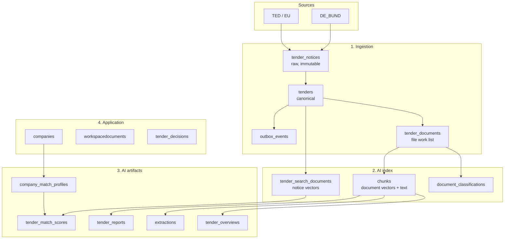

# MongoDB — the complete data model

Everything BAU AI stores lives in one MongoDB database, `bauai`. This document is
the map: what every collection is for, who writes it, who reads it, and why it is
shaped the way it is.

**Snapshot taken:** 12 August 2026, against the local development database.
Counts are that snapshot, not invariants — they are here to give a sense of scale
and of which collections are hot.

---

## 1. Connection and topology

| | |
|---|---|
| Database | `bauai` |
| Local URI | `mongodb://localhost:27018/bauai?directConnection=true` |
| Local image | `mongodb/mongodb-atlas-local:8.2` (see [docker/docker-compose.yml](../../docker/docker-compose.yml)) |
| Production | External `MONGODB_URI` — Atlas, or any deployment with `mongot` |
| Collections | 45 |
| Data size | ~2.0 GB, of which **1.6 GB is embedding vectors** |

The local deployment is `mongodb-atlas-local`, not plain `mongod`, and that is
deliberate for two independent reasons:

1. **It is a single-member replica set.** Transactions and change streams both
   require one, and the ingestion pipeline uses both.
2. **It bundles `mongot`.** Atlas Search (`$search`) and Vector Search
   (`$vectorSearch`) only exist where `mongot` runs. Plain Community `mongod`
   rejects those stages outright, and the AI retrieval stack is built on them.

`atlas-local` advertises itself as `localhost`, so every client — in-network or
on the host — must connect with `directConnection=true` rather than through
replica-set discovery. The host port is **27018**, not 27017, because dev
machines commonly run their own `mongod`.

### Three access layers, one database

| Layer | Entry point | Used by |
|---|---|---|
| Raw driver (pooled) | [lib/ingestion/db/client.ts](../../lib/ingestion/db/client.ts) | Ingestion workers, the whole AI subsystem |
| Raw driver (Next.js) | [lib/db/mongodb.ts](../../lib/db/mongodb.ts) | better-auth adapter, app-side raw queries |
| Mongoose | [lib/db/mongoose.ts](../../lib/db/mongoose.ts) | The [models/](../../models) directory — app CRUD only |

**Workers must not use Mongoose.** The worker processes run under
`--experimental-strip-types` and reach Mongo through the raw driver only; the
Mongoose models are a Next.js-side convenience for the seven app-owned
collections and nothing in `workers/` or `lib/ingestion/` may import them.

This split is why collection naming is inconsistent (§8) — it is a boundary
marker, not an oversight.

---

## 2. The five domains



| # | Domain | Collections | Owner | Rebuildable? |
|---|---|---|---|---|
| 1 | **Ingestion** — public procurement data | 12 | `lib/ingestion/`, `workers/` | From source, days |
| 2 | **AI index** — vectors and derived text | 4 | `lib/ai/embedding/`, `lib/ai/chunking/` | Yes, costs API calls |
| 3 | **AI artifacts** — model output | 15 | `lib/ai/{match,report,fit,extraction,dora}/` | Yes, costs API calls |
| 4 | **Application** — tenant-owned data | 10 | `models/`, `app/api/` | **No. This is the irreplaceable data.** |
| 5 | **Auth** | 3 | better-auth | No |

That last column is the backup priority order, read bottom-up.

---

## 3. Domain 1 — Ingestion

The pipeline that turns published procurement notices into one canonical tender
record per procedure. Architecture detail lives in
[MONGODB_TENDER_SEEDING_AND_INGESTION_ARCHITECTURE.md](../../MONGODB_TENDER_SEEDING_AND_INGESTION_ARCHITECTURE.md);
this is the storage view.

### `tender_notices` — 48,885 docs · 206 MB

Every notice version ever fetched, exactly as published. **Append-only and never
edited.** One document per `(source, noticeId, versionKey)` — a procedure that is
corrected five times leaves five rows here.

- Key fields: `source.{code,noticeId,versionKey,procedureId}`, `identity.contentSha256`, `notice.typeCode`, `publication.publishedAt`, `raw`, `snapshot`
- Unique: `uq_source_notice_version` — this constraint, not application logic, is what makes re-imports idempotent
- Why keep it: reparsing. When the parser improves, `tenders` is rebuilt from here without re-fetching a single byte from TED.

### `tenders` — 44,865 docs · 164 MB

The canonical, current view of one procurement procedure. This is what the
product actually shows and what almost everything else joins to.

- Unique: `uq_canonical_key`
- Key fields: `status`, `businessCategory`, `isVisible`, `title`, `description`, `buyer`, `lots[]`, `cpvCodes[]`, `countries[]`, `regions[]`, `submissionDeadline`, `enrichment.*`
- 12 indexes, including a `2dsphere` on `buyer.location` and `ix_status_sweep` for the 5-minute status updater
- Also carries the **`sx_tenders` Atlas Search index** (§6)

Status distribution in the snapshot: `AWARDED` 15,507 · `OPEN` 14,277 ·
`CLOSED` 12,261 · `MODIFIED` 1,370 · `CANCELLED` 680 · `UPCOMING` 507 ·
`DIRECT_AWARD` 214 · `CLOSING_SOON` 45.

> **Trap:** `countries` and `regions` are both arrays, so MongoDB refuses to
> index them together (error 171, "cannot index parallel arrays"). The index
> creates fine and only fails at insert time. They are deliberately split into
> `ix_country_status` and `ix_region_status` — see the comment in
> [lib/ingestion/db/indexes.ts:46](../../lib/ingestion/db/indexes.ts:46).

### `tender_documents` — 29,560 docs · 181 MB

The attachment work list: one record per tender's document bundle, holding a
`files[]` array with per-file S3 keys, hashes and extracted text state. Claimed
by the `documents` worker under a lease (`leaseOwner`, `heartbeatAt`) so replicas
never collide.

Status: `SKIPPED` 17,321 · `PENDING` 10,818 · `FETCHED` 1,167 · `FAILED` 254.
`SKIPPED` dominates because many notices link to portals rather than files.

`_id` is a string — `"<canonicalKey>#<hash>"` — not an ObjectId. The AI layer
carries it as `documentRecordId` on chunks and classifications.

### `outbox_events` — 48,885 docs · 23 MB

Transactional outbox. Every tender mutation writes an event in the same
transaction as the document itself, and the `outbox-relay` worker pushes them to
Redis Streams. This is what guarantees no tender change is silently lost between
Mongo and the downstream AI queues.

- Unique: `uq_aggregate_version_event` — the idempotency key
- Types: `TENDER_CREATED` 44,865 · `TENDER_UPDATED` 3,806 · `TENDER_STATUS_CHANGED` 214
- `ix_undelivered` on `{deliveredAt, nextAttemptAt}` is the relay's only query

### `dead_letter_events` — 251 docs

Notices that failed parsing or import after exhausting retries, with the full
`rawPayload` and `errorClass` retained so they can be replayed after a parser fix
rather than re-fetched.

### `raw_upload_receipts` — 48,885 docs · 13 MB

One receipt per raw payload written to S3, with `sha256`, `byteLength` and a
`committed` flag. `ix_orphan_sweep` finds uncommitted uploads so a crash between
"wrote to S3" and "wrote to Mongo" cannot leak an untracked object.

### Control-plane collections

| Collection | Docs | Purpose |
|---|---|---|
| `source_configs` | 2 | Per-source tuning: rate limits, backfill horizon, circuit-breaker threshold, licence. Currently `TED` (`eu-reuse-2011-833`) and `DE_BUND` (`dl-de-by-2.0`), both enabled. |
| `source_checkpoints` | 0 | Live-mode watermark per `(source, mode)` with a lease. Empty when no live run is mid-flight. |
| `ingestion_runs` | 15 | One row per fetch run — window, HTTP status, archive checksum, counters, heartbeat. The audit trail. |
| `seed_partitions` | 16 | Backfill work partitions with lease + progress counters, so a multi-day historical seed resumes rather than restarts. |
| `ingestion_relay_state` | 0 | Redis Streams relay position. |
| `geo_cache` | 3,217 | Geocoded `"<COUNTRY>:<POSTAL>"` → GeoJSON point, `$lookup`-joined by the relevance pipeline. TTL index expires *failed* lookups only, so a transient geocoder outage self-heals while successes stay cached forever. |

### Reference data

| Collection | Docs | Purpose |
|---|---|---|
| `cpvcodes` | 9,404 | The CPV 2008 vocabulary with EN/DE names, division, hierarchy level, keywords. Has a `$text` index used by CPV lookup and derivation. |
| `cpvsupplementarycodes` | 901 | CPV supplementary vocabulary (the bracketed qualifiers). |

> **Trap:** CPV codes carry a check digit after the hyphen (`45000000-7`). Code
> that compares or derives CPV must handle the 8-digit stem and the check digit
> deliberately — see [lib/ai/match/cpv-derive.ts](../../lib/ai/match/cpv-derive.ts).

---

## 4. Domain 2 — The AI index

Four collections that make the corpus searchable. Everything here is **derived**:
delete it all and it rebuilds from `tenders` + `tender_documents`, at the cost of
Gemini embedding calls.

### `tender_search_documents` — 44,865 docs · 923 MB ← largest collection

One curated, embedded document per tender. This is the notice-level semantic
index — the entry point for AI matching and "find tenders like this".

| Field | Meaning |
|---|---|
| `tenderId` | → `tenders._id` (unique via `uq_tender`) |
| `text` | The curated text that was embedded — title, description, lot text |
| `embedding` | **1536 floats, L2-normalized** |
| `embeddingModel` / `embeddingVersion` / `embeddingDimensions` | `gemini-embedding-001` / `2026-08` / `1536` — stamped on every vector |
| `filters` | Denormalized `{status, businessCategory, cpvCodes, countryCodes, regionCodes, procedureType, contractNature, submissionDeadline}` — the pre-filter set for `$vectorSearch` |
| `sourceHash` | Hash of `text`; unchanged hash + unchanged model ⇒ skip re-embedding |

Written by [lib/ai/embedding/notice-indexer.ts](../../lib/ai/embedding/notice-indexer.ts)
in batches — 44k notices become ~700 API calls, not 44k.

> **Trap:** `filters.status` is a *snapshot* from embedding time and lags
> `tenders.status`. It is a coarse pre-filter only; every consumer re-verifies
> against the joined tender. Likewise `filters.submissionDeadline` is
> deliberately **not** used as a range pre-filter: an Atlas range filter drops
> documents where the field is null, and 42% of tenders have no deadline, so
> filtering there would silently delete ~11k live tenders from every feed.

### `chunks` — 29,539 docs · 685 MB

Tender and company document text, chunked and embedded. The evidence layer —
every citation the AI produces points at a row here.

| Field | Meaning |
|---|---|
| `tenderId`, `documentRecordId`, `fileSha256`, `fileName` | Provenance back to `tender_documents` |
| `tenantId` | **`null` = shared tender corpus; an ObjectId = that company's private documents.** The single most security-sensitive field in the database. |
| `text`, `sectionPath[]`, `chunkIndex`, `anchor`, `tokenCount` | The chunk and where it came from |
| `docClass` | One of 12 classes (`bill_of_quantities`, `conditions_of_participation`, `suitability_proof_form`, `technical_specification`, `award_matrix`, `price_sheet`, `deadline_schedule`, `contract_conditions`, `standard_form`, `tender_notice`, `annex`, `unknown`) |
| `legalRefs[]` | Extracted `§` references, kept as exact tokens |
| `embedding` | 1536 floats, L2-normalized |

Carries **two** `mongot` indexes — `vx_chunks` (vector) and `sx_chunks`
(German-analyzed BM25). 41 chunks currently have `embeddingDimensions: 0`,
meaning chunked but not yet embedded.

> **Why `legalRefs` is a separate token field:** embeddings and stemming both
> blur "§ 13" against "§ 14". Exact-match tokens do not. The keyword arm boosts
> them ×5.

### `document_classifications` — 4,817 docs

`(documentRecordId, fileSha256)` → `docClass` with `confidence`, `method` and
`classifierVersion`. Split out from `chunks` so reclassifying does not require
re-embedding.

### `ai_index_state` — 10,470 docs

The **ledger**. One row per unit of AI work, `_id` a deterministic string key,
tracking `status` / `attempts` / `sourceHash`. This is what makes every AI
pipeline resumable — a worker crash mid-backfill resumes rather than restarts,
and re-running any script is cheap because completed units are skipped.

Kinds in the snapshot: `doc_class` 4,818 · `doc_chunks` 5,643 ·
`company_doc_embed` 5 · `extract_schema` 4.

---

## 5. Domain 3 — AI artifacts

Model output, cached. Every one of these is keyed by a **content hash** so it
self-invalidates when its inputs change — `companyDataHash` when the company
profile is edited, `corpusHash` when the underlying documents change.

### Matching

| Collection | Docs | Purpose |
|---|---|---|
| `company_match_profiles` | 2 | The company rendered as **facet vectors** — 5 per company (`services`, `trades`, `specializations`, …), each 1536-d and L2-normalized, each with a `weight`. These are *query* vectors, not indexed points, which is why they live in a normal document rather than a search index. Unique per tenant. |
| `tender_match_scores` | 400 | The persisted feed: one row per `(tenant, tender)` with `matchScore`, `fitScore`, `finalScore`, `rank`, `reasons`, `concerns`, `matchedFacets`, `signals`. Capped at `AI_MATCH_RANK_CAP` (200) per company. |
| `company_match_runs` | 2 | Run state for the matcher — `stage`, `progress`, `scoredCount`, `judgedCount`. Drives the staged progress UI. |

> **Trap:** `signals.semanticRaw` stores the raw Atlas `vectorSearchScore`.
> `SEM_FLOOR` / `SEM_CEIL` in [lib/ai/match/fusion.ts:54](../../lib/ai/match/fusion.ts:54)
> are *measured* percentiles of that band, not guesses. Re-measure them after any
> embedding model or version change — the query to do it is in the doc comment.

### Analysis and generation

| Collection | Docs | Purpose |
|---|---|---|
| `tender_reports` | 8 | The full generated tender report, per `(tenant, tender)`, with `citations` and a `tender` snapshot so an old report still renders after the tender changes. |
| `tender_report_runs` | 7 | Staged progress for report generation. |
| `tender_fit_recommendations` | 4 | "Should we bid?" analysis against the company's own corpus, with `retrievedChunkIds` for auditability. |
| `tender_overviews` | 21 | Short tender summary, cached per `corpusHash`. |
| `tender_verdicts` | 0 | Structured go/no-go verdicts, referenced from chat messages. Not yet populated. |
| `extractions` | 4 | Structured field extraction per `(tender, schemaName)`. Schemas: `award_criteria`, `deadlines`, `required_proofs`, `suitability_criteria`. Records `unresolved` fields explicitly rather than hallucinating them. |

### Chat — Clara and Dora

| Collection | Docs | Purpose |
|---|---|---|
| `chat_threads` | 29 | One per conversation. `agent` is `clara` (tender chat — 11 tender-scoped + 12 global) or `dora` (document assistant — 6). `kind` is `tender` \| `global` \| `document`. |
| `chat_messages` | 50 | Messages with `toolEvents`, `citations`, `metrics`, `locale`. |
| `chat_attachments` | 0 | User uploads into chat. TTL index `ttl_unclaimed` expires uploads never attached to a message. |
| `agent_checkpoints` | 277 · 5.6 MB | LangGraph checkpointer state, keyed by `thread_id`. **Format is frozen** — see [lib/ai/agent/threads.ts:11](../../lib/ai/agent/threads.ts:11). |
| `agent_checkpoint_writes` | 592 | LangGraph pending writes. Paired with the above; reset scripts must clear both. |

### Dora's document layer

| Collection | Docs | Purpose |
|---|---|---|
| `document_briefs` | 4 | The generated brief for a workspace document, pinned to `versionId` + `versionSha256` so a brief is never shown against a document that has since been edited. |
| `document_brief_runs` | 6 | Staged progress for brief generation. |
| `workspace_document_texts` | 7 | Extracted plain text of a workspace document, with `truncated` and `chars`. The input to briefs and Dora chat. |

---

## 6. Domain 4 — Application data

Tenant-owned. **This is the data that cannot be regenerated.**

| Collection | Docs | Model | Purpose |
|---|---|---|---|
| `companies` | 2 | [models/company.ts](../../models/company.ts) | The company profile: `services`, `trade`, `specializations`, `certifications`, `cpvCodes`, `region`, `insurances`, `referenceProjects`, `members[]`, `membershipRequests[]`, `trial`, `knowledgeBase`. **The input to all matching.** |
| `accountprofiles` | 3 | [models/account-profile.ts](../../models/account-profile.ts) | Per-user profile: `companyId`, `role`, `membershipStatus`, `locale`, `onboardingCompleted`, trial dates. The join from auth user → tenant. |
| `companyfiles` | 11 | [models/company-file.ts](../../models/company-file.ts) | Company document uploads (S3 metadata). Their text is chunked into `chunks` with `tenantId` set. |
| `tender_decisions` | 7 | [models/tender-decision.ts](../../models/tender-decision.ts) | Per-company bid/no-bid decisions with `assigneeUserId`. |
| `workspacedocuments` | 8 | [models/workspace-document.ts](../../models/workspace-document.ts) | ONLYOFFICE-editable documents. `source` is either `{kind: "upload"}` or `{kind: "tender-copy", tenderRecordId, tenderFileIndex}`. Tracks `editorRevision`, `storageRevision`, `activeEditorKey`, `activeUserIds`. |
| `workspacedocumentversions` | 15 | [models/workspace-document-version.ts](../../models/workspace-document-version.ts) | Immutable version history — every ONLYOFFICE save is a new row with its own S3 object, `sha256`, `callbackStatus` and `onlyofficeHistory`. What makes restore-to-any-version possible. |
| `documentaiusages` | 2 | — | AI usage audit per `(company, document)`: `operation`, `provider`, `model`, `durationMs`, `outcome`. |

> **`editorRevision` vs `storageRevision`** are separate counters on purpose.
> ONLYOFFICE increments its own revision on every keystroke batch; `storageRevision`
> only advances when bytes actually land in S3. Briefs pin to `storageRevision`,
> which is why a forcesave is required before generating one.

### Auth — better-auth owned

`user` (6) · `session` (11) · `account` (6). Created and managed by
`@better-auth/mongo-adapter` ([lib/auth.ts](../../lib/auth.ts)) with Google and
Microsoft social providers. Singular names, no application-defined indexes —
**do not hand-edit these or add Mongoose models over them.**

There is no organization plugin; tenancy is carried by
`accountprofiles.companyId`, not by better-auth.

---

## 7. Search indexes (`mongot`)

Four indexes live outside the collections, in `mongot`. They are not visible to
`getIndexes()` — use `$listSearchIndexes`.

| Index | Collection | Type | Serves |
|---|---|---|---|
| `vx_tender_search_documents` | `tender_search_documents` | vectorSearch, cosine, 1536-d | AI matching's per-facet ANN; "find similar tenders" |
| `vx_chunks` | `chunks` | vectorSearch, cosine, 1536-d | The vector arm of hybrid retrieval |
| `sx_chunks` | `chunks` | search, `lucene.german` | The keyword arm, plus exact `legalRefs` tokens |
| `sx_tenders` | `tenders` | search, `lucene.german` + `standard` multi | The notice-text matching arm (`W_TEXT_ARM = 0.9`) |

Defined in [lib/ai/db/search-indexes.ts](../../lib/ai/db/search-indexes.ts) and
created by `scripts/ai-bootstrap.mts`.

```bash
mongosh "mongodb://localhost:27018/bauai?directConnection=true" --eval "db.chunks.aggregate([{\$listSearchIndexes:{}}])"
```

Three things to know:

1. **The vectors themselves are ordinary BSON arrays in ordinary collections.**
   `mongot` keeps its own Lucene HNSW copy; you can never browse that copy, only
   its build status. `mongodump` backs up the vectors regardless.
2. **`$search` and `$vectorSearch` reject the client's default majority read
   concern.** Every call site passes `{readConcern: {level: "local"}}`. Omitting
   it is a runtime error, not a warning.
3. **`sx_tenders` uses two analyzers per field.** `lucene.german` does the
   stemming and decompounding that makes "Elektroinstallationsarbeiten"
   reachable from "Elektroinstallation"; the `standard` multi keeps the 17% of
   the corpus that is not German searchable at all.

Why German analysis matters here and not elsewhere: on a lot-split notice — the
dominant shape in German construction procurement — the trade is named in the
lot and nowhere else. "Neubau FFW Schwarzholz" says nothing; "Los 4
Elektroinstallation" says everything.

---

## 8. Conventions

**Naming is split by access layer, and that is the signal.**

| Style | Example | Means |
|---|---|---|
| `snake_case` | `tender_search_documents` | Raw driver — ingestion or AI. Registered in a `collectionNames` map. |
| `lowercaseplural` | `workspacedocuments` | Mongoose default pluralization — an app-owned model. |
| `singular` | `user`, `session` | better-auth. Hands off. |

The one exception is `tender_decisions`, a Mongoose model with an explicit
`collection:` override.

**Identifiers are English, always.** `deadlines`, `suitability_criteria`,
`required_proofs` — never `Fristen` or `Eignungskriterien`. German appears only
inside prompt text and language heuristics. [GLOSSARY.md](../GLOSSARY.md) maps
the domain terms for readers.

**Every derived artifact carries a version and a hash.** `embeddingModel` +
`embeddingVersion`, `chunkerVersion`, `classifierVersion`, `pipelineVersion`,
`profileVersion`, `promptVersion` alongside `sourceHash` / `corpusHash` /
`companyDataHash`. The pattern is always the same: recompute the hash, compare,
skip if equal. This is what makes every backfill script safe to re-run.

**Tenant scoping is by `tenantId`, and `null` is meaningful.** On `chunks`,
`null` means the shared tender corpus that every company may read. Filters that
must not cross the boundary use exactly one `tenantId` equality with **no** null
branch — see `companyVectorFilter` and `companyFilterClauses`, both exported
purely so the tenant-safety unit tests can assert on them. Company-corpus
retrieval also re-applies `tenantId` on the document fetch, so a bug in the
search filter still cannot leak across tenants.

---

## 9. Operations

### Sizes

| Collection | Size | Share |
|---|---|---|
| `tender_search_documents` | 923 MB | 46% |
| `chunks` | 685 MB | 34% |
| `tender_notices` | 206 MB | 10% |
| `tender_documents` | 181 MB | 9% |
| `tenders` | 164 MB | 8% |
| everything else | ~50 MB | 2% |

**~0.9 GB of the ~2.0 GB total is raw embedding vectors** — 74,363 vectors ×
1536 dims × 8 bytes per BSON double. The two vector collections together are
1.6 GB; the rest of that is the chunk and notice text stored alongside. A
1536-float array makes each document ~21 KB, which is why Compass and Atlas Data
Explorer struggle to render these collections. Always project the vector away
when browsing:

```bash
mongosh "mongodb://localhost:27018/bauai?directConnection=true" --eval "db.tender_search_documents.find({}, {embedding: 0}).limit(3)"
```

To peek at a vector without dumping 1536 values:

```bash
mongosh "mongodb://localhost:27018/bauai?directConnection=true" --eval "db.tender_search_documents.findOne({}, {embedding: {\$slice: 8}, text: 1, embeddingModel: 1})"
```

### Backup priority

1. **`companies`, `accountprofiles`, `companyfiles`, `tender_decisions`, `workspacedocuments`, `workspacedocumentversions`, `user`, `session`, `account`** — irreplaceable. Tiny. Back these up most often.
2. **`tender_notices`** — replaceable only by re-fetching from TED/DE_BUND, which is slow and rate-limited. `tenders` rebuilds from it.
3. **Everything AI-derived** — regenerates from 1 + 2, at the cost of Gemini API calls. Recoverable, not free.

### Memory

`mem_limit` on the Mongo container defaults to 4 GB
([docker/docker-compose.yml](../../docker/docker-compose.yml)). It is bounded
because an unbounded `mongot` vector-index build wedged host-wide Docker during
the 44k-notice embedding backfill on a 16 GB machine. OOM-killing the container
is recoverable — every AI pipeline resumes from `ai_index_state`.

### Useful checks

```bash
mongosh "mongodb://localhost:27018/bauai?directConnection=true" --eval "db.ai_index_state.aggregate([{\$group:{_id:{kind:'\$kind',status:'\$status'},n:{\$sum:1}}}])"
```

```bash
mongosh "mongodb://localhost:27018/bauai?directConnection=true" --eval "db.outbox_events.countDocuments({deliveredAt: null})"
```

---

## 10. Quick reference

| Collection | Docs | Domain | One-line purpose |
|---|---|---|---|
| `account` | 6 | Auth | better-auth credentials / social links |
| `accountprofiles` | 3 | App | User → company membership, role, locale |
| `agent_checkpoint_writes` | 592 | AI chat | LangGraph pending writes |
| `agent_checkpoints` | 277 | AI chat | LangGraph conversation state |
| `ai_index_state` | 10,470 | AI index | Resumable work ledger for all AI pipelines |
| `chat_attachments` | 0 | AI chat | Chat uploads, TTL-expired if unclaimed |
| `chat_messages` | 50 | AI chat | Messages with tool events and citations |
| `chat_threads` | 29 | AI chat | Conversations — Clara (tender) and Dora (document) |
| `chunks` | 29,539 | AI index | Embedded document text + BM25 source |
| `companies` | 2 | App | Company profile — the input to matching |
| `company_match_profiles` | 2 | AI match | Company as weighted facet query vectors |
| `company_match_runs` | 2 | AI match | Matcher run state and progress |
| `companyfiles` | 11 | App | Company document uploads |
| `cpvcodes` | 9,404 | Reference | CPV 2008 vocabulary, EN/DE |
| `cpvsupplementarycodes` | 901 | Reference | CPV supplementary vocabulary |
| `dead_letter_events` | 251 | Ingestion | Failed notices, retained for replay |
| `document_brief_runs` | 6 | Dora | Brief generation progress |
| `document_briefs` | 4 | Dora | Generated document brief, version-pinned |
| `document_classifications` | 4,817 | AI index | File → docClass with confidence |
| `documentaiusages` | 2 | App | AI usage audit per document |
| `extractions` | 4 | AI artifact | Structured fields per tender + schema |
| `geo_cache` | 3,217 | Ingestion | Postal code → GeoJSON point |
| `ingestion_relay_state` | 0 | Ingestion | Redis Streams relay position |
| `ingestion_runs` | 15 | Ingestion | Fetch-run audit trail |
| `outbox_events` | 48,885 | Ingestion | Transactional outbox → Redis Streams |
| `raw_upload_receipts` | 48,885 | Ingestion | S3 raw-payload receipts + orphan sweep |
| `seed_partitions` | 16 | Ingestion | Resumable backfill partitions |
| `session` | 11 | Auth | better-auth sessions |
| `source_checkpoints` | 0 | Ingestion | Live-mode watermark per source |
| `source_configs` | 2 | Ingestion | Per-source rate limits and licence |
| `tender_decisions` | 7 | App | Company bid / no-bid decisions |
| `tender_documents` | 29,560 | Ingestion | Attachment work list + S3 file records |
| `tender_fit_recommendations` | 4 | AI artifact | "Should we bid?" analysis |
| `tender_match_scores` | 400 | AI match | The persisted AI feed, ranked |
| `tender_notices` | 48,885 | Ingestion | Raw notice versions, append-only |
| `tender_overviews` | 21 | AI artifact | Cached tender summary |
| `tender_report_runs` | 7 | AI artifact | Report generation progress |
| `tender_reports` | 8 | AI artifact | Full generated tender report |
| `tender_search_documents` | 44,865 | AI index | Notice-level embeddings + filters |
| `tender_verdicts` | 0 | AI artifact | Structured go/no-go verdicts |
| `tenders` | 44,865 | Ingestion | Canonical tender — the product's core entity |
| `user` | 6 | Auth | better-auth users |
| `workspace_document_texts` | 7 | Dora | Extracted text of a workspace document |
| `workspacedocuments` | 8 | App | ONLYOFFICE-editable documents |
| `workspacedocumentversions` | 15 | App | Immutable ONLYOFFICE version history |

---

## Related documents

- [AI_SUBSYSTEM.md](../AI_SUBSYSTEM.md) — how the AI layer uses these collections
- [MONGODB_TENDER_SEEDING_AND_INGESTION_ARCHITECTURE.md](../../MONGODB_TENDER_SEEDING_AND_INGESTION_ARCHITECTURE.md) — the ingestion pipeline in depth
- [docs/migration-docs/data-migration-plan.md](../migration-docs/data-migration-plan.md) — the Supabase → MongoDB migration
